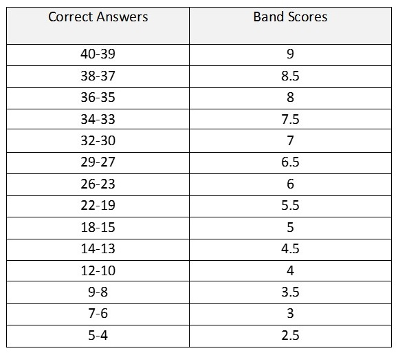

# DataStructures-2

Done Yet?: Yes

<aside>
 Go To

[Python Master](https://www.notion.so/Python-Master-8530b135b17949e0a328363c74f6a880?pvs=21)

[Road Map](https://www.notion.so/Road-Map-ed62d78a4fc74318bae9cec5b3804e27?pvs=21)

</aside>

# Objectives

- Defining Strings, Numbers, Lists, Tuples, Sets, Dictionaries
- Mutable and non-mutable objects
- Basic Indexing

# My Tasks

* Consume all the resources serially
* "In the [Notes](#Notes) section, write some notes"
* Focus mainly on indexing or slicing of each data structures
<br>

# Resources

| Title                                             | URL                                              |
|:--------------------------------------------------|:-------------------------------------------------|
| 01. Basic DataTypes \| John Elder                 | https://youtu.be/d9iBMdSAQWk                     |
| 02. String \| Corey Schafer                       | https://youtu.be/k9TUPpGqYTo                     |
| 03. Numbers \| Corey Schafer                      | https://youtu.be/khKv-8q7YmY                     |
| 04. Lists, Tuples & Sets \| Corey Schafer         | https://youtu.be/W8KRzm-HUcc                     |
| 05. Dictionaries \| Corey Schafer                 | https://youtu.be/daefaLgNkw0                     |
| 07. Slice Operator \| Tech with Tim               | https://youtu.be/L0j7JkFmYDI                     |
| 08. Part-1: Mutable vs Immutable \| Tech with Tim | https://youtu.be/2pCxRTu5SHc                     |
| 09. Part-2: Mutable vs Immutable \| Corey Schafer | https://youtu.be/5qQQ3yzbKp8                     |
| 06. Python Data Types with coding examples.       | https://www.geeksforgeeks.org/python-data-types/ |

---

# Notes

---

…

```python
***# data types***
# strings
name = 'Lira'
# numbers
age = 27
# lists
name = ['Lira','Shifat','Bintee']
print(name[0])
# dictionaries
hobbies = {
    'Shifat': 'Coding', 
    'Lira': 'Astrophysics'
    }
print(hobbies['Shifat'])
# bboolean
jsu = True
print(jsu)

***#strings***
message = 'My name is Anika Mahzabin'

print(message)

# if there is a 's in your string then use " " this

message = "Lira's world"
print(message)

# if there is a quote in your string then use ' ' this

message = 'Shams said, "Donot disturb me".'
print(message)

#using len function one can get the length of the string

message = 'Hello, World!'
print(len(message))
print(message[0])

#first index is inclusive and last index is exclusive(not included)

print (message [0:3])

#If you don't specify the first index it will automatically take the first-slicing

print(message[:3])

#If you don't specify the last index it will automatically take the last-slicing

print(message[0:])
#we can manupulate a string as lower,upper,append,replace,find,count
new_message = message.lower()

print(new_message)

new_message = message.upper()

print(new_message)

#count words
new_message = message.count('Hello')
print(new_message)

#count letter
new_message = message.count('l')
print(new_message)

#find will say from where/which index a letter or a word starts
#find letter
new_message = message.find('l')
print(new_message)

#find word (returns -1 if it can't find)
new_message = message.find('Hello')
print(new_message)

# replace method takes two arguments, first what i want to replace, second with what i am replacing

new_message = message.replace('Hello','Hi')
print(new_message)

 # adding strings - method 1
greeting = 'hello'
name = 'lira'
 
message = greeting + ', '+ name

print(message)

 # string formatting - method 1
new_message = '{},{}. Welcome!'.format(greeting,name)

print(new_message)

 # string formatting - method 3 (f string method, widely used , most popular, can be only used in 3.6 or higher)

new_message = f'kire {name}, {greeting} nai khobor nai ken tor'

print(new_message)
 #as u can use placeholder inside here so u can do the operations here too this is a very good thing.

new_message = f'kire {name.upper()}, {greeting} nai khobor nai ken tor'

print(new_message)

# to sse how many methods can be used with a string we can use dir function
print(dir(name))

#we can also use help function to know more about string methods

print(help(str))

***#numbers*

# how to see types of a number
num = 3
print (type(num))

# arithmetic operations

# addition : 3+2
print(312+265)
# subtraction: 3-2
print(312-265)
# multiplication: 3*2
print(312*265)
# division: 3/2 ,it will take the decimal
print(3/2)
# floor division: 3//2,it will ignore the decimal
print(3//2)
# exponent: 3**3, it works like power 3**3=3*3*3
print(3**3)
# modulus: 3 % 2, it prints remainder of the division , it usually helps to define either a number is even or odd
print(3%2)

# abs and round

print(type(-3))

print(round(3.75,1))

# it will print 3.8 as 1 means will keep rounding version to first position

# comparisons : 
# Equal: 3 == 2
#not equal: 3!=2
# greater than : 3 > 2
# less than : 3 < 2
# greater or equal: 3 >= 2
# less or equal : 3 <= 2

*### lists*
courses = ['History','Math','Physics','CompSci']

print(courses)
print(len(courses))
print(courses[0])
# 1 brings the last one
print(courses[-1])
# if u give  a index that doesnt exist u will get a index error
# print(courses[4])
# first index is inclusive and last one is exclusive
print(courses[0:2])
# if we don't give anything at the beginning it will be same
print(courses[:2])
# if we don't give anything at the end it will indicate end
print(courses[2:])
courses.append('Art')
print(courses)

# if you want to add something at a specific index use index
courses.insert(0,'Art')
print(courses)
#we can also insert a list into a list
lira=['girl','harsd-working','beautiful','brave']
courses.insert(0,lira)
print(courses)
# to just add the elements use extend method
courses.extend(lira)
print(courses)
# to remove an item you can use remove method
courses.remove('beautiful')
print(courses)
# if you use pop method then the last element of the list will be removed
courses.pop()
print(courses)
# if you assign it in a variable then it will return the popped item
popped = courses.pop()
print(popped)
print(courses)
# to sort alphabetically or numerically (ascending) use sort method
lor=['Anika','Sabbir','Al-Amin']
lor.sort()
print(lor)

# ascending to descending use reverse
lor.sort(reverse=True)

# we can use sorted function to sort the list

sorted_courses = sorted(lor)
print(sorted_courses)

# to print min/max/sum of a list
nums=[1,2,3,5,7,9,8]
print(min(nums))

#if you want to find a index of a certain value you can use index method for this
print(courses.index('Math'))
# if we want to check if any element is in our list?
print('Art' in courses)
print('Math' in courses)
# to see the all the items of a list we can use for loop
for item in courses:
    print(item)
# using enumerate function we can see the items with their index

for index,item in enumerate(courses):
    print(index,item)

# we can also fix from where to start:
for index,item in enumerate(courses, start=1):
    print(index,item)

# we can use join method to convert list to string
lor=['Anika','Sabbir','Al-Amin']
lor_str = ','.join(lor)
print(lor_str)

# string to list?
new_list = lor_str.split(',')
print(new_list)

*## tuples*
print(list_1)
print(list_2)
#the change made in both the lists

## what is immutable??
tuple_1 = ('History','Math','Physics','CompSci')
tuple_2 = tuple_1
MyList = list(tuple_1)

# Changing 
MyList[0] = 'Art'

# Converting list back to tuple
tuple_1 = tuple(MyList)

print(tuple_1)
print(tuple_2)
#the change made in both the lists
#the change was not made in both the tuples
# tuples doesnot accept item assignment because they are immutable
#it also doesn't support remove,append etc
#it supports other methods without what mutates it

*## set*
cs_courses = {'Art','History','Science','Art'}
print(cs_courses)
# As u see sets throe away duplicates
print('Art' in cs_courses)

art_courses=['Art','Scociology','rocket Science']

# in two sets we can use intersection to get the common courses

print(cs_courses.intersection(art_courses))

# we can also see the difference using difference method

print(cs_courses.difference(art_courses))

# to see all the courses we can use union method

print(cs_courses.union(art_courses))

## How to create empty set???

#emptyset= {}, this is wrong this means empty dictionary

empty_set = set()  
print(empty_set)

*## dictionary :*

## dictionaries allow us to work with key value pair
# key is the unique identifier where we can find our data and the value is the data
student = {'name':'Lira','age':'27','courses': ['Math','Compsci']}
print(student)
#how to call specific key?
print(student['name'])
#integer can also be a key
student = {1:'Lira','age':'27','courses': ['Math','Compsci']}
print(student[1])

# we can also use get method to bring any key , in this case if we call a key that doesn't exist in the dictionary it will return none. It wont give error.

print(student.get('age'))
print(student.get('phone'))

# using update method we can add/update key values

student.update({'age': '25','phone': '3333-5678'})
print(student)

# we can delete key using del

del student['age']
print(student)

# we can also use pop

popped = student.pop('phone')
print(student)
print(popped)

# to see  keys/values/all we have use len

print(len(student))
print(student.keys())
print(student.values())
print(student.items())

# we can also use for loop to see them

for key in student:
    print(key)

for key,value in student.items():
    print(key,value)

*## slice operator*

fruits = ['apples','pear','strawberrys']
text= 'Hello I like python'

# slice operator

# print(text[start:stop:step]) / print(text[start:stop]) / print(text[start])

print(text[0:5])

print(text[:5])

print(text[:]) # putting nothing means start to end

print(text[::2]) # skip after every letter

print(fruits[1:])

# inserting something at a specific position of a list

fruits[1:1]='b'

print(fruits)
 

*https://www.geeksforgeeks.org/python-data-types/***

```

# Code

---

```python

```

# Questions

> In each coding section, you first need to run and test the code in your local machine. Then copy the final version of the code then paste it in the answer. You are not allowed to use google or other forms of help in any of the questions below.
> 
1. **What do you understand by mutable and immutable data structures?**
    
    <aside>
    📝 Answer: mutable data structures are changable but immutable data structures are not changable after declaration.
    
    </aside>
    
2. **Write at least 3 differences between a list and a tuple?**
    
    <aside>
    📝 Answer: 1. We use square bracket in case of lists but in case of tuples, we use first bracket. 2. Tuples are constant we can not perform modification on them whereas lists are dynamic and we can append, delete and replace elements of a list. 3. As lists are mutable they consumes more memory whereas tuples are immutable they consulme less memory.
    
    </aside>
    
3. **Demonstrate how would you declare every data structures you have learned today.** 
    
    <aside>
    📝 Answer:
    
    ```python
    # paste your code here
    **# data types**
    # strings
    name = 'Lira'
    # numbers
    age = 27
    # lists
    name = ['Lira','Shifat','Bintee']
    print(name[0])
    # dictionaries
    hobbies = {
        'Shifat': 'Coding', 
        'Lira': 'Astrophysics'
        }
    print(hobbies['Shifat'])
    # boolean
    jsu = True
    print(jsu)
    ```
    
    </aside>
    
4. **Declare a `string` variable then perform different type of indexing and slicing on it.**
    
    <aside>
    📝 Answer:
    
    ```python
    # paste your code here
    
    message = 'Hello, World!'
    
    print(message[0])
    
    #first index is inclusive and last index is exclusive(not included)
    
    print (message [0:3])
    
    #If you don't specify the first index it will automatically take the first-slicing
    
    print(message[:3])
    
    #If you don't specify the last index it will automatically take the last-slicing
    
    print(message[0:])
    
    # you can specify the last index with -1
    
    print(message[-1])
    
    # if you want to see a range with -indexing
    
    print (message[-3:-1])
    
    print (message[:-2]) #it will show the full string excluding the last element
    
    # you can also declare start,end and skip
    
    print(message[0:6:1]) #it will skip every alternate element
    
    # to see a string inversely you can use
    
    print(message[::-1])
    
    ```
    
    </aside>
    
5. **Declare a `list` and a `tuple` variable then perform different type of indexing on them.**
    
    <aside>
    📝 Answer:
    
    ```python
    # paste your code here
    courses = ['History','Math','Physics','CompSci']
    print(courses[0])
    # 1 brings the last one
    print(courses[-1])
    # first index is inclusive and last one is exclusive
    print(courses[0:2])
    # if we don't give anything at the beginning it will be same
    print(courses[:2])
    # if we don't give anything at the end it will indicate end
    print(courses[2:])
    
    courses = ('History','Math','Physics','CompSci')
    # you can use the same indexing and slicing operations on this tuple
    ```
    
    </aside>
    
6. **How do you find how long a data type is? Is it applicable on number types?**
    
    <aside>
    📝 Answer: with len function I can find how long the data type is. No it is not applicable on float or integer, it is only possible for sequential data types such as: string,list etc.. Example:
    
    ```python
    message = 'Hello, World!'
    
    print(len(message))
    ```
    
    </aside>
    
7. **How would you extract the first and last entry of a `string` or `list` type variable? Demonstrate example.**
    
    <aside>
    📝 Answer:
    
    ```python
    # paste your code here
    string ='Lira'
    # bring the first entry
    print(string[0])
    # bring the last entry
    print(string[-1])
    ```
    
    </aside>
    
8. **Suppose you have a list, `bands = ['oasis', ‘beatles’, ‘smiths’, ‘creed’, ‘nirvana’]`. Print the 3rd element of the list in python. Also print the middle 3 elements in python. Lastly, Is it possible to change the 4th item of the list to `blur`? If so, demonstrate how then explain why it was or was not possible.**
    
    <aside>
    📝 Answer:
    
    ```python
    # paste your code here
    bands = ['oasis', 'beatles', 'smiths', 'creed', 'nirvana']
    
    # 3rd element
    print(bands[2])
    
    # middle 3 elements
    print(bands[1:4])
    
    # changing the 4th element
    bands[3] = 'blur'
    
    print(bands) # 
    
    # it was possible because lists are mutable
    ```
    
    </aside>
    
9. **Suppose you have a tuple called `bands`  with the same elements of [Question 8](https://www.notion.so/DataStructures-2-06d4f8030b7c44c689265ba594ba8dd9?pvs=21). Print the 2nd character of the 4th element of the list in python. Also print the first 3 elements. Lastly, Is it possible to change the 4th item of the tuple to `blur`? If so, demonstrate how then explain why it was or was not possible.**
    
    <aside>
    📝 Answer:
    
    ```python
    # paste your code here
    bands =('oasis', 'beatles', 'smiths', 'creed', 'nirvana')
    
    x = bands[3]
    print(x[1])
    print(bands[0:3])
    
    # bands[3]='blur'
    # this is not possible in case of tuples cause they are immutable , so alternate way is to change it to a list then do the assignment and then again change it to tuple.
    
    y = list(bands)
    
    y[3] = 'blur'
    
    z = tuple(y)
    
    print(z)
    
    ```
    
    </aside>
    
10. **Suppose you have a string,  `sentence = "I have scored 8.0 on IELTS."`. Now complete the python code below. Just write your code beneath the comments.**
    
    <aside>
    📝 Answer:
    
    ```python
    # declare the varialbe below
    
    sentence = "I have scored 8.3 on IELTS."
    
    # Make the sentence in all upper case and print it.
    upper = sentence.upper()
    print(upper)
    #print(sentence)
    
    #  Print the last word in the sentence using slicing.
    print(sentence[-6:-1])
    #print(sentence[0:3])
    
    # Extract the number in the sentence and convert it into a number type. Also prove that it is a number type.
    x=sentence[14:17]
    print(x)
    y=float(x)
    print(y)
    print(type(y))
    
    ```
    
    </aside>
    
11. **Suppose you have a list, `bands = [’oasis’, ‘beatles’, ‘smiths’, ‘smiths’, ‘oasis’]`.  Print the unique values of the list.** 
    - See Hint
        
        *Convert it to a particular data type*
        
    
    <aside>
    📝 Answer:
    
    ```python
    # paste your code here.
    bands = ['oasis', 'beatles', 'smiths', 'smiths', 'oasis']
    
    x=set(bands)
    print(x)
    
    y=list(x)
    print(y)
    ```
    
    </aside>
    
12. **Declare a dictionary of 6 items.  Then print  the 3rd item in using python code. After that print all the keys of the dictionary.********
    
    <aside>
    📝 Answer:
    
    ```python
    # paste your code here.
    student = {'name':'Lira','age':'27','courses': ['Math','Compsci'],'status':'married','country':'BD','session':'spring'}
    y=[]
    
    for key,value in student.items():
        x = key,value
        y.append(x)
    print(y[2])
    
    # Oneliner: print(f"{list(student.keys())[2]} : {student[list(student.keys())[2]]}")
    
    for key in student:
        print(key)
    
    # Oneliner: print(student.keys())
    ```
    
    </aside>
    
13. ********Declare a dictionary of 6 items.  Then print the 3rd item in using python code. After that print all the keys of the dictionary. Then update the 6th item with a new value.********
    
    <aside>
    📝 Answer:
    
    ```python
    # paste your code here.
    student = {'name':'Lira','age':'27','courses': ['Math','Compsci'],'status':'married','country':'BD','session':'spring'}
    y=[]
    
    for key,value in student.items():
        x = key,value
        y.append(x)
    print(y[2])
    
    for key in student:
        print(key)
    
    student.update({'session':'fall'})
    
    print(student)
    ```
    
    </aside>
    
14. **Suppose you have two lists. One contains the list of vowels and the other contains the great lakes of the USA. (See [this link](https://listexplored.com/things-that-come-in-fives/#:~:text=Great%20Lakes%3A,and%20ecological%20significance.)). If the number of the elements in these two lists are same then print `'high-5. What a match!’`.**
    
    <aside>
    📝 Answer:
    
    ```python
    # paste your code here.
    list_1 = ['A','E','I','O','U']
    list_2 = ['Lake Superior','Lake Michigan', 'Lake Huron', 'Lake Erie', 'Lake Ontario']
    
    x = len(list_1)
    y = len(list_2)
    
    if x == y:
        print('high-5. What a match!')
    else:
        print('No match')
    
    ```
    
    </aside>
    
15. Below is an image of IELTS Academic Listening Score system:
    
    
    
    
    **Convert this table to a python `dictionary`.** 
    
    - **The key of the dictionary will be the band scores.**
    - **The numbers of correct answers will be in the values in a list format.**
    
    **Then using dictionary indexing, write a code to extract the minimum number to achieve a Band score of 8.5.** 
    
    <aside>
    📝 Answer:
    
    ```python
    # paste your code here.
    listening = {'9': [39,40],'8.5':[37,38],'8':[35,36],'7.5':[33,34],'7':[30,31,32],'6.5': [27,28,29],'6':[23,24,25,26],'5.5':[19,20,21,22],'5':[15,16,17,18],'4.5':[13,14],'3.5':[8,9],'3':[6,7],'2.5':[4,5]}
    score = listening['8.5']
    print (f'Minimum score to achieve band 8.5 is {score[0]}')
    
    ```
    
    </aside>
    

---
